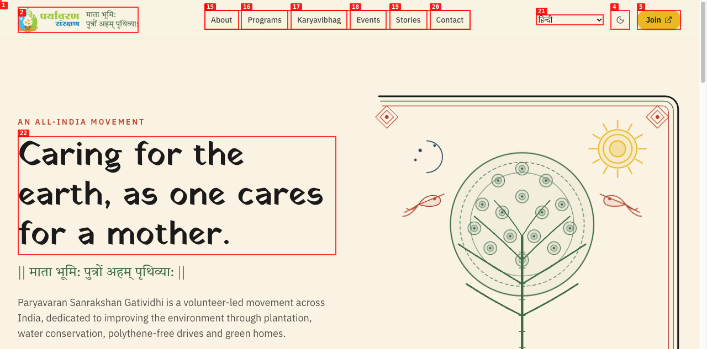
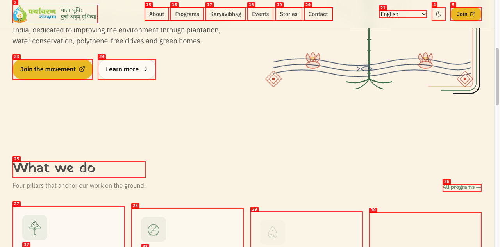
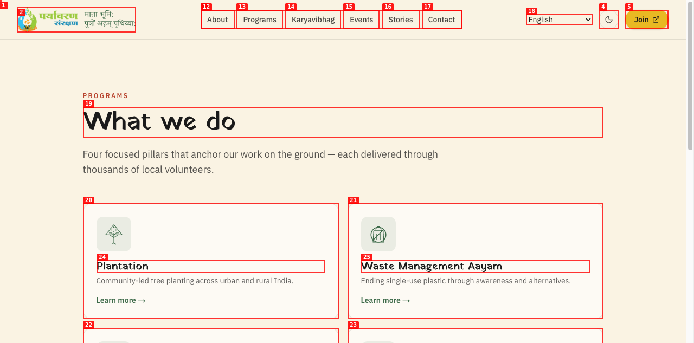
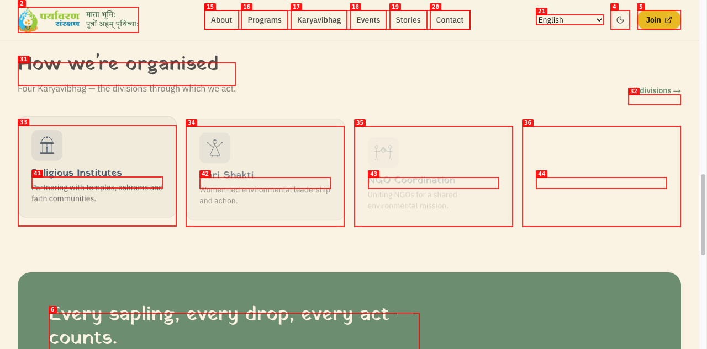
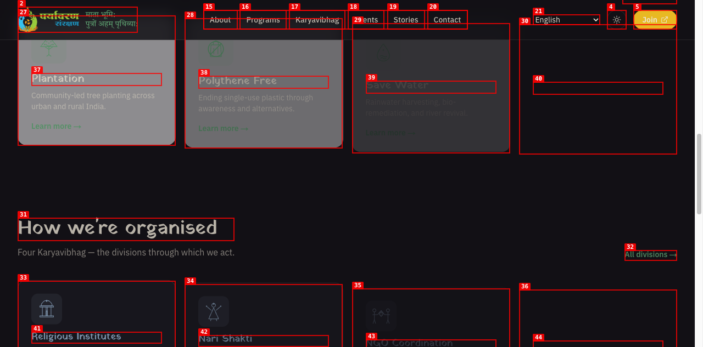
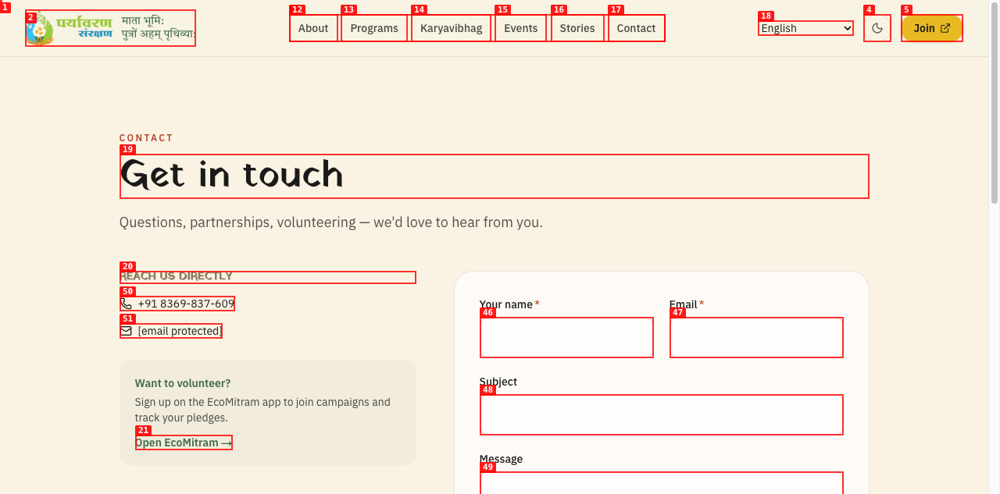
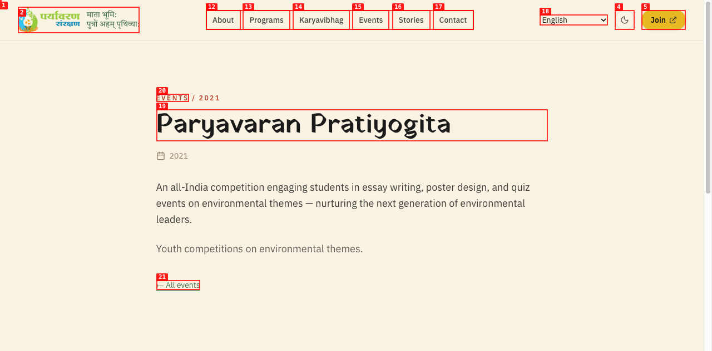

# Dogfood Report: Paryavaran Sanrakshan

| Field | Value |
|-------|-------|
| **Date** | 2026-04-16 |
| **App URL** | https://paryavaransanrakshan-org.vercel.app |
| **Session** | paryavaran |
| **Scope** | Full app |

## Summary

| Severity | Count |
|----------|-------|
| Critical | 0 |
| High | 2 |
| Medium | 3 |
| Low | 2 |
| **Total** | **7** |

## Issues

### ISSUE-001: Language selector does not translate content

| Field | Value |
|-------|-------|
| **Severity** | high |
| **Category** | functional |
| **URL** | https://paryavaransanrakshan-org.vercel.app/ |
| **Repro Video** | N/A |

**Description**

Language selector in the header shows 9 language options (Hindi, Marathi, Gujarati, etc.). Selecting any language changes the dropdown value but all page content remains in English. No translation occurs. This is misleading for users who expect localized content.

**Repro Steps**

1. Navigate to homepage
2. Change language selector from "English" to "हिन्दी"
3. **Observe:** Dropdown shows "हिन्दी" but all text remains in English
   

---

### ISSUE-002: Homepage "Polythene Free" vs Programs page "Waste Management Aayam" naming inconsistency

| Field | Value |
|-------|-------|
| **Severity** | medium |
| **Category** | content |
| **URL** | https://paryavaransanrakshan-org.vercel.app/ |
| **Repro Video** | N/A |

**Description**

The second program is called "Polythene Free" on the homepage cards but "Waste Management Aayam" on the /programs page. Confusing for users navigating between the two. Both descriptions are identical ("Ending single-use plastic through awareness and alternatives").

**Repro Steps**

1. View homepage "What we do" section -- program is called "Polythene Free"
   
2. Navigate to /programs -- same program is called "Waste Management Aayam"
   

---

### ISSUE-003: 4th cards in both homepage sections appear blank/empty

| Field | Value |
|-------|-------|
| **Severity** | high |
| **Category** | visual |
| **URL** | https://paryavaransanrakshan-org.vercel.app/ |
| **Repro Video** | N/A |

**Description**

On the homepage, the 4th card in both the "What we do" (Harit Ghar) and "How we're organised" (Educational Institutes) sections appears partially or fully blank. In light mode, the Educational Institutes card shows no icon and has very faded text. In dark mode, the Harit Ghar card is completely empty -- no icon, no heading, no description visible.

**Repro Steps**

1. Scroll to "How we're organised" section on homepage (light mode)
   
2. Switch to dark mode and scroll to "What we do" cards
   

---

### ISSUE-004: Google Sign-In (GSI) console errors

| Field | Value |
|-------|-------|
| **Severity** | medium |
| **Category** | console |
| **URL** | https://paryavaransanrakshan-org.vercel.app/ |
| **Repro Video** | N/A |

**Description**

Two console errors from Google Sign-In (GSI) appear on every page load:
1. `[GSI_LOGGER]: Your client application uses one of the Google One Tap prompt UI status methods that may stop functioning when FedCM becomes mandatory.`
2. `[GSI_LOGGER]: FedCM get() rejects with NetworkError: Error retrieving a token.`

These suggest Google One Tap login integration is broken or misconfigured. No visible Google sign-in UI appears on the page, so this may be leftover code.

**Repro Steps**

1. Navigate to any page and open browser console
2. **Observe:** Two GSI errors logged on every page load

---

### ISSUE-005: Contact form "Message" field missing required asterisk

| Field | Value |
|-------|-------|
| **Severity** | low |
| **Category** | ux |
| **URL** | https://paryavaransanrakshan-org.vercel.app/contact |
| **Repro Video** | N/A |

**Description**

The contact form labels "Your name" and "Email" show a required asterisk (*). The "Message" field is also marked `required` in HTML but its label does not show an asterisk. Inconsistent visual indicator of required fields.

**Repro Steps**

1. Navigate to /contact
   
2. **Observe:** "Your name *" and "Email *" have asterisks, "Message" does not despite being required

---

### ISSUE-006: Dark mode program cards have low text contrast

| Field | Value |
|-------|-------|
| **Severity** | medium |
| **Category** | accessibility |
| **URL** | https://paryavaransanrakshan-org.vercel.app/ |
| **Repro Video** | N/A |

**Description**

In dark mode, the "What we do" program cards have a gray background with muted text. The "Save Water" card in particular has very low contrast -- heading and body text are barely readable against the gray card background.

**Repro Steps**

1. Toggle dark mode on homepage, scroll to program cards
   
2. **Observe:** "Save Water" and "Harit Ghar" cards have poor text-to-background contrast

---

### ISSUE-007: Event detail pages have thin/sparse content

| Field | Value |
|-------|-------|
| **Severity** | low |
| **Category** | content |
| **URL** | https://paryavaransanrakshan-org.vercel.app/events/paryavaran-pratiyogita |
| **Repro Video** | N/A |

**Description**

Event detail pages show a title, date, one paragraph of description, then a duplicate one-liner below it, followed by the "All events" back link. The content feels sparse -- no photos, no call-to-action, no related events. The duplicate one-liner ("Youth competitions on environmental themes.") appears both as the description on the listing card and as a separate line below the main description on the detail page.

**Repro Steps**

1. Navigate to /events, click "Paryavaran Pratiyogita"
   
2. **Observe:** Very short content with duplicated summary line

---
